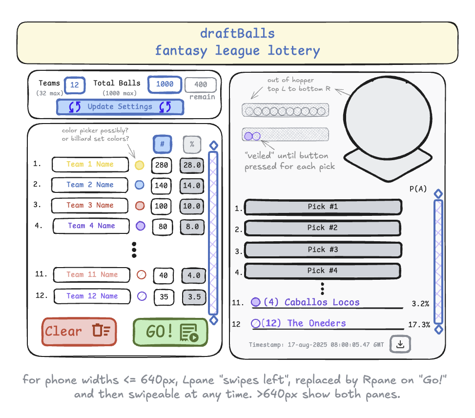

# draftballs
## Project Description
For fantasy sports leagues, this webapp recreates the excitement of a draft lottery where balls are assigned 
to teams and spun in a hopper for selection of draft order.

## Deliverables
* MVP: 
  * select number of teams, assign number of lottery balls to each team, jumble as an array of balls.
  * pull the "winning" balls in inverse order, from last to first, to raise the anticipation
  * some type of "refresh guard" to persist state when a bunch of names are typed and/or revealed and whoops, refresh, lost it all.
  * must work via deploy to GitHub Pages (no server-side capabilities)
* stretch goals: "floor" and "ceiling" for teams (this team can pick no worse than 4th, etc.); improved color & font theming; suspense music W/ MUTE DEFAULT of course; improved media breakpoints
* super-stretch goal: 2D or (god-tier) 3D visualization of actual balls in the hopper

## Mockup

## To Run
Simply open your browser to https://rudil24.github.io/draftballs/. This webapp is 100% client-side Javascript with React components, running in GitHub Pages.

## Development Workflow
- [ x ] 1. install the React + vite packages to local 
- [ x ] 2. commit & push shell/demo then follow [PedroTech's youtube instructions](https://www.youtube.com/watch?v=hn1IkJk24ow) to make sure it will run on GitHub Pages
- [ x ] 3. spike/POC to see if I can get a simple form with state memory to not go blank on reload/refresh. https://rudil24.github.io/persistpoc/
- [ ] 4. build MVP. task breakdown:
  - [ ] ask for settings: numTeams and numBalls per team 
  - [ ] render form and get array of teamName[] with submit/clear
  - [ ] on submit, build hopper array & logic so we get "true" elements spawned, jumbled, being picked at random, and then removed from the hopper before the next pull. many of the existing draft tools just do blob percentages (oh you have 10 of the 50 balls? then any Math(random) from 0.0 to 0.2 is yours.) that ain't it.
  - [ ] progressive disclosure of the balls picked, in inverse order (or user choice of order?)
- [ ] 5. Test local, deploy to GH Pages, test w/ users

## Reflection
|   |   |
|---|---|
| 20-aug-2025 | OK got a rudimentary (get it) version going in indexOG.html. i need to make it tighter/compartmentalized with the teams update button (it just appends stuff to the form rn.) but the refresh happy path works. i'll look to compartmentalize as i move it to react, and fix its absolute ugliness in the display. but the MATH and hopper functionality IS THERE!
| 18-aug-2025 | i blocked myself by probably trying to do too much in React, too soon. i got into vaporlock on hooks and props, which slowed me from getting to the functional blocks of what the code had to do. Tomorrow, i'm going to spin up an oldschool pure javascript/html version (no styling) and see if that can help get me unstuck on parsing out the React components the right way. | 
| 17-aug-2025 | enjoying excalidraw.com for simple mockups, love how clean the interface is. (too bad i built such a busy mock in it.)
| 16-aug-2025 | useState and useEffect coming in clutch for the refresh guard proof of concept. just needed to get confident that GHPages or Vite wouldn't do something weird. glad i did that first. Onward! |
| 15-aug-2025 | just starting, pumped that the Vite+React publish (of just shell project) to GH Pages works so well |

## References

### React + Vite

This project built inside the React = Vite template that provides a minimal setup to get React working in Vite with HMR and some ESLint rules.

Currently, two official plugins are available:

- [@vitejs/plugin-react](https://github.com/vitejs/vite-plugin-react/blob/main/packages/plugin-react) uses [Babel](https://babeljs.io/) for Fast Refresh
- [@vitejs/plugin-react-swc](https://github.com/vitejs/vite-plugin-react/blob/main/packages/plugin-react-swc) uses [SWC](https://swc.rs/) for Fast Refresh

### Expanding the ESLint configuration

If you are developing a production application, we recommend using TypeScript with type-aware lint rules enabled. Check out the [TS template](https://github.com/vitejs/vite/tree/main/packages/create-vite/template-react-ts) for information on how to integrate TypeScript and [`typescript-eslint`](https://typescript-eslint.io) in your project.

